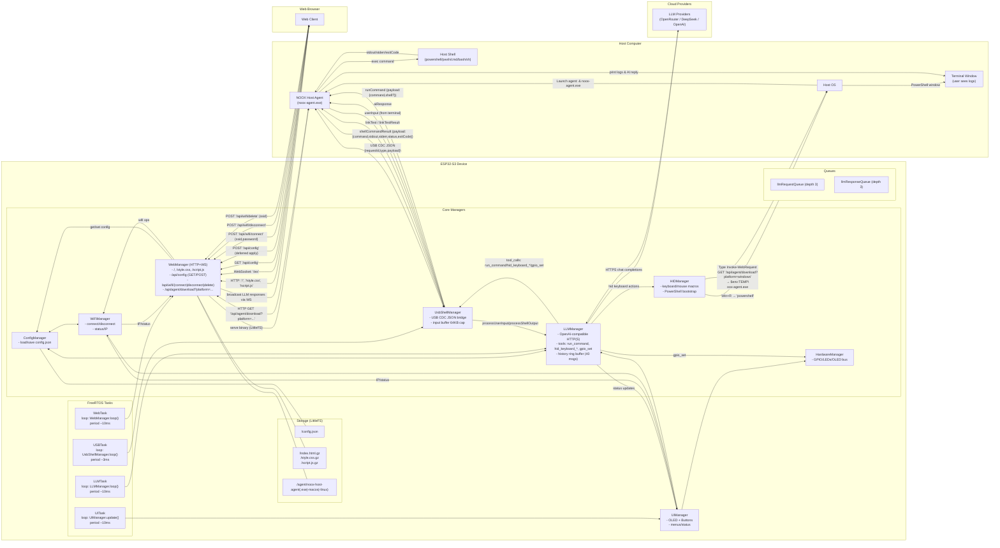

# NOOX Shell + AI Hardware Device

NOOX 是一套面向“外接硬件 + 桌面自动化 + 大模型”场景的开源方案，强调即插即用与可移植性。基于 ESP32‑S3，设备通过 USB HID + CDC 接入任意主机，内置 Web 控制台与 LLM 自主规划执行能力；主机侧由 NOOX Host Agent 与设备进行 USB CDC JSON 交互，跨平台执行 Shell 并反馈结果。系统通过 Web 从设备拉取并启动主机代理，并支持目标导向的多步规划、自动工具调用与迭代执行。

## 关键特性
- USB 复合设备：HID（键盘/鼠标）、CDC（虚拟串口）
- AI 集成：支持 OpenRouter / DeepSeek / OpenAI（OpenAI 兼容接口）
- AI 自主规划执行：高级模式下可基于上下文与命令输出进行多步规划、调用工具并自动迭代执行直至达成目标
- Web 控制台：内置 HTTP + WebSocket，提供配置界面与调试
- 主机代理自动引导：通过 HID 打开 PowerShell，使用 Invoke‑WebRequest 从设备下载并执行代理
- 跨平台 Shell：支持 powershell/pwsh/cmd/bash/sh 等
- 工具能力：run_command、hid_keyboard_type、hid_keyboard_press、hid_keyboard_macro、gpio_set

## 架构图

## 快速开始
1) 准备环境
- VS Code + PlatformIO 插件
- Python 3（用于运行打包脚本）
2) 添加配置：
- 在config_manager.cpp中使用自己的API key和WiFi信息替换掉占位符。
- 添加需要的模型名称（可选）
3) 拉取依赖并编译固件
- 在 VS Code/PlatformIO 中打开工程
- 构建固件：pio run

4) 准备 LittleFS 数据（内置 Web 与 Agent）
- 运行：python compress_files.py
  - 生成 data/index.html.gz、data/style.css.gz、data/script.js.gz
  - 复制/压缩主机代理到 data/agent/noox-host-agent.exe（可选使用 UPX）
- 上传 LittleFS：pio run --target uploadfs

5) 烧录固件并连接设备
- 上传固件：pio run --target upload
- 通过 Type‑C 连接到主机，系统会识别为 HID + CDC 设备

6) 配置 WiFi
- 首次启动由设备通过 HID 注入脚本，引导主机填入 WiFi 凭证（SSID|Password）
- 打开浏览器访问设备 IP（OLED 状态页可查看），进入 Web UI 配置 WiFi

7) 自动下载并运行主机代理
- 设备通过 HID 打开 PowerShell，执行 Invoke‑WebRequest 从 http://<设备IP>/api/agent/download?platform=windows 下载 agent 到临时目录并启动
- 代理与设备通过 USB CDC 建立 JSON 信道，开始交互

## Web 接口
- 静态资源：/, /style.css, /script.js
- WebSocket：/ws（广播/接收 LLM 消息）
- 配置：
  - GET /api/config（获取当前配置）
  - POST /api/config（更新配置，后台应用并保存）
- WiFi：
  - POST /api/wifi/connect（表单：ssid、password）
  - POST /api/wifi/disconnect
  - POST /api/wifi/delete（表单：ssid）
- 代理下载：
  - GET /api/agent/download?platform=windows|macos|linux

## USB CDC 消息协议（主机 ↔ 设备）
- Host → ESP32：
  - userInput：{"requestId","type":"userInput","payload":"text"}
  - linkTest：{"requestId","type":"linkTest","payload":"ping"}
  - shellCommandResult：{"requestId","type":"shellCommandResult","payload":{"command","stdout","stderr","status","exitCode"}}
- ESP32 → Host：
  - runCommand（新版）：{"requestId","type":"runCommand","payload":{"command","shell?"}}
  - shellCommand（旧版兼容）：{"requestId","type":"shellCommand","payload":"ls -la"}
  - aiResponse：{"requestId","type":"aiResponse","payload":"text"}
  - linkTestResult：{"requestId","type":"linkTestResult","status":"success|error","payload":"pong"}
- WiFi 凭证：通过一行文本“SSID|Password”（非 JSON）发送，由设备解析后调用 WiFiManager 连接

## LLM 工具（设备侧）
- run_command：在主机执行命令（可指定 shell）
- hid_keyboard_type：HID 键盘输入文本
- hid_keyboard_press：HID 按键组合与特殊键
- hid_keyboard_macro：键盘动作序列（type/press/delay）
- gpio_set：控制设备上的 GPIO/LED

## AI 自主规划执行（Advanced Mode）
- 工作原理：
  - 用户输入或上一条命令输出会被传入 LLM。
  - LLM 基于上下文生成工具调用（tool_calls），例如 run_command / hid_* / gpio_set。
  - 设备将工具结果回传给 LLM，LLM继续迭代，直到达成目标或用户中止。

- 典型流程：
  1) 用户下达目标（例如“在桌面新建一个README.txt并写入内容”）。
  2) LLM 规划：检查系统、定位目录、选择合适 shell。
  3) 调用 run_command 执行 mkdir/echo/type/powershell 脚本等；或用 HID 操作 UI。
  4) 根据 shellCommandResult 的 stdout/stderr/exitCode 决策下一步。
  5) 完成后返回摘要与变更清单。

- 示例（Windows，代理终端中用户输入）：
  - “抓取我的网络配置并保存到桌面文件” → LLM：run_command("ipconfig","cmd") → 解析结果 → run_command("Set-Content $env:USERPROFILE\\Desktop\\net.txt ...","powershell")。
  - “查询正在运行的进程并结束特定程序” → LLM：run_command("Get-Process","powershell") → 分析 → run_command("Stop-Process -Name notepad -Force","powershell")。

## 安全与风险（重要）
- 高权限能力：LLM 在高级模式下可发起 run_command（任意 shell 命令）以及 HID 操作（模拟键盘/快捷键）。这意味着部分情况下本设备 **可能执行危险操作**（删除文件、网络渗透、数据外传等）。请在标准用户会话中运行 Agent，避免以管理员/root 身份运行。
- 免责声明：本项目提供强大的自动化能力，**请谨慎使用并自担风险**。建议在隔离、可回滚的环境中评估后再使用。

## 性能与限制（简要）
- CDC 输出限制：stdout/stderr 单项最大约 20KB，超出将截断
- CDC 读取：周期 ~3ms，单次最多读取 512B，输入缓冲上限 64KB

## 构建主机代理（可选）
- 需要 Go 1.21+
- 进入 host-agent 目录：
  - go build -o noox-host-agent.exe
- 然后运行 python compress_files.py 将其复制/压缩到 data/agent/

## 故障排查
- Web 无法访问：确认设备已连接 WiFi（OLED 状态页），或通过串口日志查看 IP
- 代理未启动：检查 HID 是否自动打开 PowerShell；必要时手动运行下载命令并启动代理
- CDC 无输出：检查系统是否识别为虚拟串口，尝试重新插拔或更换线缆
- LLM 调用失败：确认 API Key 与网络连通性（设备通过 HTTPS 访问 LLM 提供商）

## 许可
本项目代码与文档的许可以仓库根目录的 LICENSE 为准。

