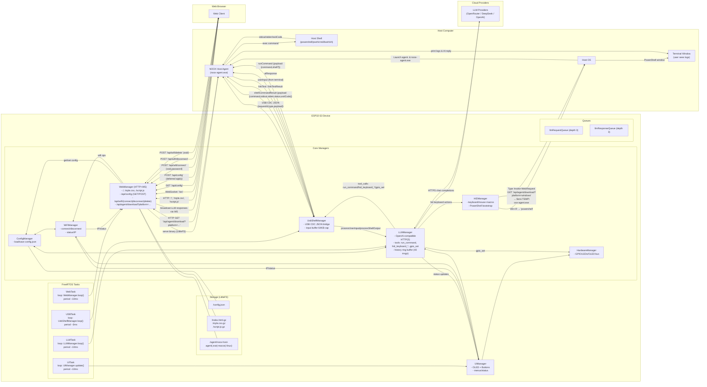

# NOOX Shell + AI Hardware Device

[English](README.md) | [简体中文](README.zh-CN.md)

NOOX is an open-source platform for external hardware, desktop automation, and LLM-driven task execution. Built on the ESP32-S3, it connects to any host through USB HID + CDC, provides an onboard web console, and works with a host-side NOOX Host Agent over a USB CDC JSON channel to execute shell commands across platforms.

NOOX is officially certified by the [Open Source Hardware Association (OSHWA)](https://certification.oshwa.org/cn000025.html).

- OSHWA UID: `CN000025`
- Open hardware files: [OSHWLab / 立创开源硬件平台](https://oshwhub.com/hgyzqxt/noox)

  

## Key Features

- USB composite device: HID (keyboard/mouse) + CDC (virtual serial)
- AI integration with OpenRouter, DeepSeek, and OpenAI-compatible APIs
- Autonomous multi-step planning and execution in advanced mode
- Built-in web console over HTTP + WebSocket for configuration and debugging
- Host agent bootstrap through HID-triggered PowerShell download and launch
- Cross-platform shell execution support for `powershell`, `pwsh`, `cmd`, `bash`, and `sh`
- Device tools: `run_command`, `hid_keyboard_type`, `hid_keyboard_press`, `hid_keyboard_macro`, `gpio_set`

## Architecture

## Quick Start

1. Prepare the environment
   - VS Code with the PlatformIO extension
   - Python 3 for asset packaging
2. Add configuration
   - Replace placeholder API keys and Wi-Fi settings in `config_manager.cpp`
   - Add the model name you want to use if needed
3. Build the firmware
   - Open the project in VS Code / PlatformIO
   - Run `pio run`
4. Prepare LittleFS assets
   - Run `python compress_files.py`
   - This generates `data/index.html.gz`, `data/style.css.gz`, and `data/script.js.gz`
   - It can also copy/compress the host agent into `data/agent/noox-host-agent.exe`
   - Upload LittleFS with `pio run --target uploadfs`
5. Flash the device
   - Run `pio run --target upload`
   - Connect the board through USB Type-C; it will enumerate as HID + CDC
6. Configure Wi-Fi
   - On first boot, the device can inject a script through HID to help provide Wi-Fi credentials
   - Open the device IP shown on the OLED status page and finish setup in the web UI
7. Launch the host agent
   - The device opens PowerShell through HID and downloads the agent from `http://<device-ip>/api/agent/download?platform=windows`
   - The agent starts and communicates with the device over the USB CDC JSON channel

## Web API

- Static assets: ` / `, `/style.css`, `/script.js`
- WebSocket: `/ws`
- Config
  - `GET /api/config`
  - `POST /api/config`
- Wi-Fi
  - `POST /api/wifi/connect`
  - `POST /api/wifi/disconnect`
  - `POST /api/wifi/delete`
- Agent download
  - `GET /api/agent/download?platform=windows|macos|linux`

## USB CDC Message Protocol

- Host to ESP32
  - `userInput`: `{"requestId","type":"userInput","payload":"text"}`
  - `linkTest`: `{"requestId","type":"linkTest","payload":"ping"}`
  - `shellCommandResult`: `{"requestId","type":"shellCommandResult","payload":{"command","stdout","stderr","status","exitCode"}}`
- ESP32 to Host
  - `runCommand`: `{"requestId","type":"runCommand","payload":{"command","shell?"}}`
  - `shellCommand`: `{"requestId","type":"shellCommand","payload":"ls -la"}`
  - `aiResponse`: `{"requestId","type":"aiResponse","payload":"text"}`
  - `linkTestResult`: `{"requestId","type":"linkTestResult","status":"success|error","payload":"pong"}`

## Advanced Autonomous Execution

In advanced mode, the LLM can plan multiple steps based on user input and command output, call tools such as `run_command` and `hid_*`, evaluate results, and continue iterating until the goal is reached or the user stops the task.

## Safety

- Advanced mode can issue shell commands and HID actions, so misuse may lead to destructive behavior.
- Run the host agent in a standard user session instead of as administrator or root.
- Evaluate the system in an isolated, recoverable environment before broader use.

## Limitations

- CDC `stdout` and `stderr` are each capped at about 20 KB and may be truncated
- CDC polling period is about 3 ms with up to 512 B read each cycle
- Input buffer limit is 64 KB

## Building the Host Agent

- Requires Go 1.21+
- Build inside `host-agent`
- Example: `go build -o noox-host-agent.exe`
- Then run `python compress_files.py` to package it into `data/agent/`

## Troubleshooting

- Web UI unavailable: verify Wi-Fi connection and device IP
- Agent did not launch: check whether HID successfully opened PowerShell
- No CDC output: reconnect the cable or verify the virtual serial device is recognized
- LLM requests fail: check API keys and outbound HTTPS connectivity

## License

Code and documentation in this repository are licensed under the terms in [LICENSE](LICENSE).
