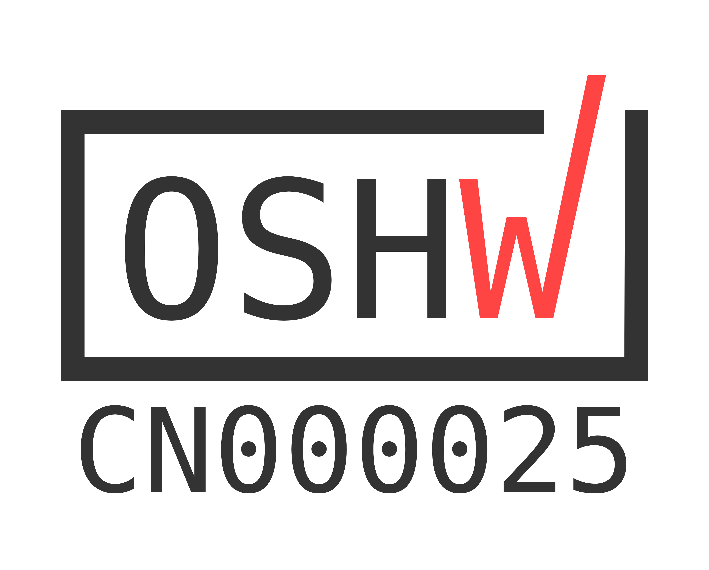
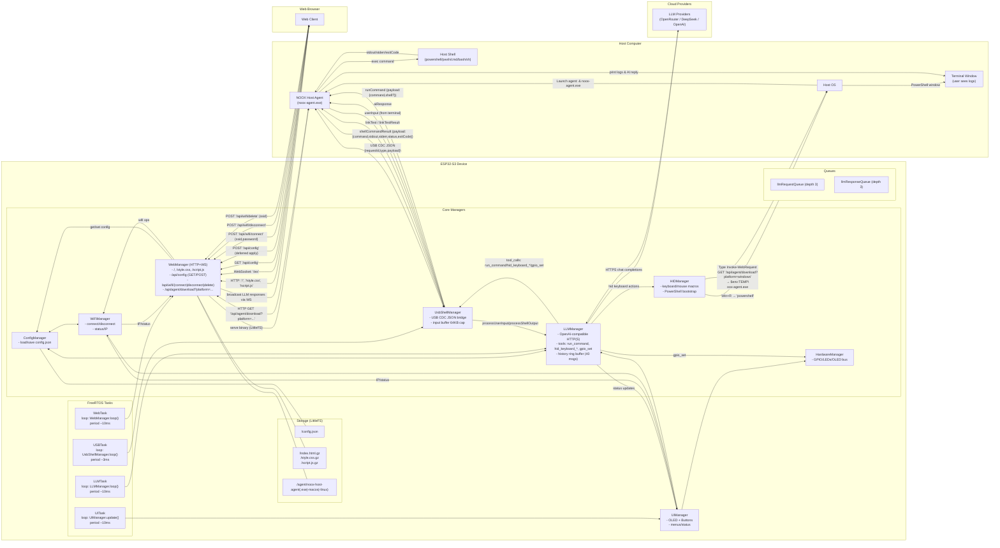

# NOOX Shell + AI Hardware Device

[English](README.md) | [简体中文](README.zh-CN.md)

NOOX 是一套面向“外接硬件 + 桌面自动化 + 大模型”场景的开源方案，强调即插即用与可移植性。基于 ESP32-S3，设备通过 USB HID + CDC 接入任意主机，内置 Web 控制台与 LLM 自主规划执行能力；主机侧由 NOOX Host Agent 与设备进行 USB CDC JSON 交互，跨平台执行 Shell 并反馈结果。

## OSHWA 官方认证

NOOX 已获得 [Open Source Hardware Association (OSHWA) 官方认证](https://certification.oshwa.org/cn000025.html)。

- OSHWA UID：`CN000025`

## 关键特性

- USB 复合设备：HID（键盘/鼠标）、CDC（虚拟串口）
- AI 集成：支持 OpenRouter、DeepSeek、OpenAI 兼容接口
- AI 自主规划执行：高级模式下可基于上下文与命令输出进行多步规划、调用工具并自动迭代执行直至达成目标
- Web 控制台：内置 HTTP + WebSocket，提供配置界面与调试能力
- 主机代理自动引导：通过 HID 打开 PowerShell，自动下载并启动 Host Agent
- 跨平台 Shell：支持 `powershell`、`pwsh`、`cmd`、`bash`、`sh`
- 工具能力：`run_command`、`hid_keyboard_type`、`hid_keyboard_press`、`hid_keyboard_macro`、`gpio_set`

## 架构图

## 快速开始

1. 准备环境
   - VS Code + PlatformIO 插件
   - Python 3（用于运行打包脚本）
2. 添加配置
   - 在 `config_manager.cpp` 中使用自己的 API Key 和 Wi-Fi 信息替换占位符
   - 按需添加模型名称
3. 拉取依赖并编译固件
   - 在 VS Code / PlatformIO 中打开工程
   - 执行 `pio run`
4. 准备 LittleFS 数据
   - 执行 `python compress_files.py`
   - 生成 `data/index.html.gz`、`data/style.css.gz`、`data/script.js.gz`
   - 可同时复制或压缩主机代理到 `data/agent/noox-host-agent.exe`
   - 执行 `pio run --target uploadfs` 上传 LittleFS
5. 烧录固件并连接设备
   - 执行 `pio run --target upload`
   - 通过 Type-C 连接主机，系统会识别为 HID + CDC 设备
6. 配置 Wi-Fi
   - 首次启动时，设备可通过 HID 注入脚本引导输入 Wi-Fi 凭证
   - 打开 OLED 状态页显示的设备 IP，在 Web UI 中完成配置
7. 自动下载并运行主机代理
   - 设备会通过 HID 打开 PowerShell，并从 `http://<设备IP>/api/agent/download?platform=windows` 下载代理
   - 代理启动后通过 USB CDC JSON 信道与设备通信

## Web 接口

- 静态资源：`/`、`/style.css`、`/script.js`
- WebSocket：`/ws`
- 配置
  - `GET /api/config`
  - `POST /api/config`
- Wi-Fi
  - `POST /api/wifi/connect`
  - `POST /api/wifi/disconnect`
  - `POST /api/wifi/delete`
- 代理下载
  - `GET /api/agent/download?platform=windows|macos|linux`

## USB CDC 消息协议

- Host → ESP32
  - `userInput`：`{"requestId","type":"userInput","payload":"text"}`
  - `linkTest`：`{"requestId","type":"linkTest","payload":"ping"}`
  - `shellCommandResult`：`{"requestId","type":"shellCommandResult","payload":{"command","stdout","stderr","status","exitCode"}}`
- ESP32 → Host
  - `runCommand`：`{"requestId","type":"runCommand","payload":{"command","shell?"}}`
  - `shellCommand`：`{"requestId","type":"shellCommand","payload":"ls -la"}`
  - `aiResponse`：`{"requestId","type":"aiResponse","payload":"text"}`
  - `linkTestResult`：`{"requestId","type":"linkTestResult","status":"success|error","payload":"pong"}`

## AI 自主规划执行（Advanced Mode）

高级模式下，LLM 会根据用户输入和命令输出做多步规划，调用 `run_command`、`hid_*` 等工具，结合执行结果继续迭代，直到目标完成或用户中止。

## 安全与风险

- 高级模式可以发起 Shell 命令和 HID 操作，误用可能导致破坏性行为
- 建议在标准用户权限下运行 Host Agent，不要使用管理员或 root 权限
- 建议先在隔离、可回滚环境中评估后再投入更广泛使用

## 性能与限制

- CDC 的 `stdout` / `stderr` 单项最大约 20 KB，超出会被截断
- CDC 轮询周期约 3 ms，单次最多读取 512 B
- 输入缓冲上限为 64 KB

## 构建主机代理

- 需要 Go 1.21+
- 进入 `host-agent` 目录
- 示例：`go build -o noox-host-agent.exe`
- 然后执行 `python compress_files.py` 打包到 `data/agent/`

## 故障排查

- Web 无法访问：确认设备已连上 Wi-Fi，并检查设备 IP
- 代理未启动：确认 HID 是否成功打开 PowerShell
- CDC 无输出：重新插拔数据线，或确认系统是否识别虚拟串口
- LLM 调用失败：检查 API Key 和设备的 HTTPS 连通性

## 许可

本仓库代码与文档的许可条款以 [LICENSE](LICENSE) 为准。
