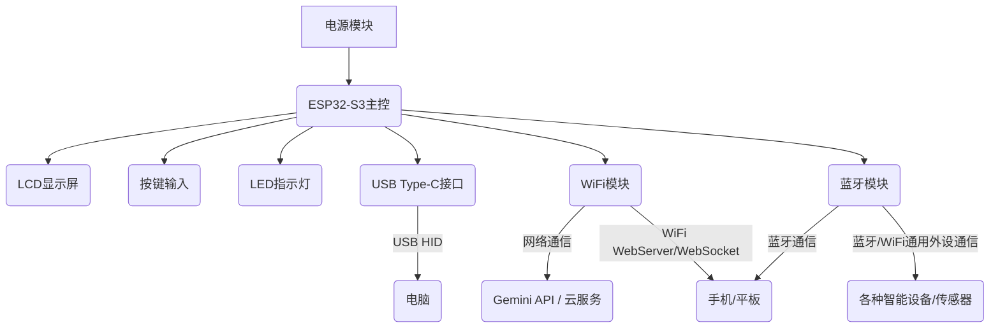
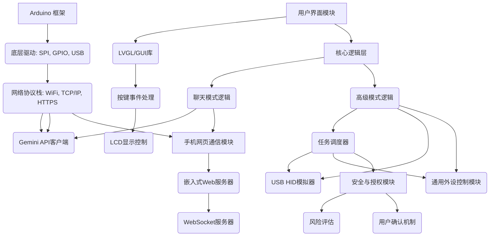

一款基于 ESP32-S3 和 Gemini 大模型的智能硬件产品，具备“聊天模式”和“高级模式”。它能像真人一样与用户自然交流，并在高级模式下自主规划并执行任务，通过 USB 控制电脑，并通过 WiFi 和蓝牙实现类似 Flipper Zero 的广泛外设交互能力，同时确保高风险操作的用户授权。

---

## TODO（待完善功能）

- [x] 蓝牙通信与BLE GATT服务/客户端实现
- [x] WiFi扫描与多网络管理、与其他WiFi设备通信（如MQTT/HTTP等）
- [ ] 通用外设协议解析与动态控制模块
- [ ] 更丰富的系统级操作（如文件管理、屏幕截图、音量管理等）
- [ ] 特定软件自动化（如浏览器、IDE、办公软件等）
- [x] LCD图形界面（轻量级实现）与多页面交互
- [x] 网页端功能扩展（如任务历史、设备状态、蓝牙/WiFi管理等）
- [ ] 通用任务类型扩展（如wifi、bluetooth等action类型）
- [ ] 协议与任务解析的可扩展性（插件式/动态扩展）

---

### **产品功能概述**

*   **聊天模式：**
    *   通过手机网页界面发送文本指令进行自然语言交流。
    *   接收 Gemini 的文本回复，并在手机网页和设备 LCD 上实时显示。
*   **高级模式：**
    *   **自主任务规划与执行：** Gemini 大模型根据用户指令自主分析、规划并执行复杂任务。
    *   **USB 电脑控制：** 通过 USB HID 模拟键盘，执行广泛的电脑操作，包括：
        *   **模拟键盘：** 文本输入、快捷键操作（如复制粘贴、切换窗口）、命令行输入与执行。
        *   **系统级操作：** 打开/关闭应用程序、文件管理（创建、删除、重命名）、屏幕截图、音量控制、电源管理等。
        *   **特定软件交互：** 在浏览器中打开 URL、在 IDE 中执行命令、办公软件自动化等。
    *   **灵活的外设交互（参照 Flipper Zero）：**
        *   **WiFi 通信：** 扫描网络、连接 WiFi、作为客户端或服务器与智能家居设备（如智能灯泡、插座）、物联网传感器等进行通信和控制。发送 HTTP/HTTPS 请求到 Web 服务或 API。
        *   **蓝牙通信：** 扫描蓝牙设备、建立连接、作为 BLE GATT 服务或客户端与智能手环、健康监测设备、蓝牙传感器等进行数据交换。模拟蓝牙键盘/鼠标控制其他支持蓝牙 HID 的设备（如手机、平板、电脑）。
    *   **安全性：**
        *   **高风险操作授权：** 某些高风险操作（如删除文件、格式化硬盘、执行系统关键命令）需在 LCD 上显示警告，并要求用户通过手机网页或设备按键进行二次确认。
        *   **通信加密：** 手机网页与设备之间的通信采用 WSS (WebSocket Secure) 加密。

### **最终架构方案**

#### **1. 硬件架构**

*   **ESP32-S3主控：** 核心处理器，具备强大的计算和通信能力。
*   **LCD显示屏：** 用于显示对话内容、任务状态、安全提示等。
*   **按键输入：** 用于模式切换、菜单导航、以及高风险操作的物理确认。
*   **LED指示灯：** 提供设备状态的视觉反馈。
*   **USB Type-C接口：** 供电、固件烧录，并在高级模式下作为 USB HID 与电脑通信。
*   **WiFi模块：** 用于连接互联网访问 Gemini API，并作为 Web 服务器/WebSocket 服务器与手机网页交互，同时支持与其他 WiFi 设备通信。
*   **蓝牙模块：** 支持 BLE GATT 服务和客户端模式，用于与手机及其他蓝牙设备通信，并可模拟蓝牙 HID。

#### **2. 软件架构**

*   **Arduino 框架：** 基础开发框架，提供硬件抽象和便捷的开发接口。
*   **底层驱动：** 负责与所有硬件外设（LCD、按键、LED、USB）进行底层交互。
*   **网络协议栈：** 实现 WiFi 连接、TCP/IP、HTTPS 安全连接，支持 Gemini API 访问和手机网页通信。
*   **Gemini API 客户端：** 负责与 Gemini API 进行文本请求和响应的交互。
*   **用户界面模块：**
    *   **轻量级 LCD 界面：** 利用底层 LCD 驱动实现文本和基本图形显示，用于显示对话内容、任务状态和安全提示。
    *   **按键事件处理：** 响应用户按键操作，包括模式切换和高风险操作的确认。
    *   **LCD 显示控制：** 管理 LCD 内容的更新。
*   **核心逻辑层：**
    *   **聊天模式逻辑：** 协调手机网页输入、Gemini API 交互和 LCD 显示。
    *   **高级模式逻辑：**
        *   **任务调度器：** 解析 Gemini 生成的任务计划，调用相应的执行模块，并与安全模块协作处理高风险操作。
        *   **USB HID 模拟器：** 已实现 USB 键盘协议，能够向电脑发送指令。
        *   **通用外设控制模块：** 这是一个关键模块，它将包含：
            *   **WiFi 扫描与连接管理：** 发现并连接 WiFi 网络。
            *   **WiFi 客户端/服务器：** 实现 TCP/UDP 或 HTTP/MQTT 等协议，与各种 WiFi 设备通信。
            *   **蓝牙扫描与连接管理：** 发现并连接蓝牙设备。
            *   **BLE GATT 服务/客户端：** 实现通用属性配置文件，与 BLE 设备进行数据交换。
            *   **蓝牙 HID 模拟：** 模拟蓝牙键盘。
            *   **协议解析器：** (暂不开发)
*   **手机网页通信模块：**
    *   **嵌入式 Web 服务器：** 在 ESP32-S3 上运行，提供 HTML、CSS、JavaScript 文件，构建用户交互界面。
    *   **WebSocket 服务器：** 实现手机网页与 ESP32-S3 之间的实时、双向通信通道。
*   **安全与授权模块：**
    *   **风险评估：** 识别 Gemini 任务中的高风险操作。
    *   **用户确认机制：** 已实现，在 LCD 上显示警告，并等待用户通过手机网页或设备按键进行确认。
    *   **通信加密：** 确保 WebSocket 通信的安全性。
    *   **固件安全更新：** 考虑实现 OTA 固件签名验证。

你将负责所有软件层面的开发
